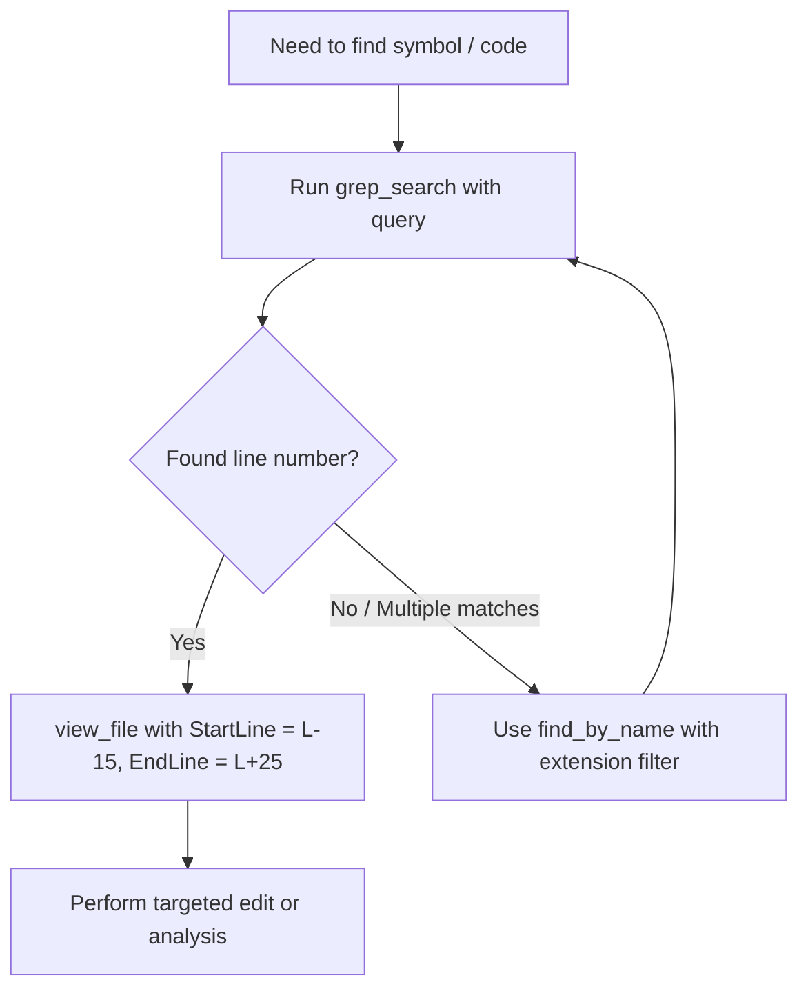

# Token Budget Optimizer

A comprehensive runbook for minimizing prompt tokens, context bloat, and generation overhead while maintaining maximal precision in code modifications and architectural reasoning.

## Contents
- [Core Principles: The 4 R's of Token Efficiency](#core-principles-the-4-rs-of-token-efficiency)
- [Workflow: Surgical File Inspection](#workflow-surgical-file-inspection)
- [Workflow: Minimal-Chunk Editing](#workflow-minimal-chunk-editing)
- [Workflow: Subagent Context Offloading](#workflow-subagent-context-offloading)
- [Dart/Flutter Token-Saving Cheatsheet](#dartflutter-token-saving-cheatsheet)
- [Scripts & Helpers](#scripts--helpers)

---

## Core Principles: The 4 R's of Token Efficiency

1. **Reduce Scope**: Never read 500 lines when 30 lines contain the relevant function. Use `grep_search` first to identify line numbers, then use `view_file` with precise `StartLine` and `EndLine`.
2. **Route to Lightweight Models**: Delegate broad searches, indexing, or documentation scanning to `flash` or `flash_lite` subagents. Their context is isolated and does not bloat the primary agent's transcript.
3. **Replace, Don't Rewrite**: Use `replace_file_content` with minimal target chunks instead of `write_to_file` on entire files. Full file rewrites consume input and output tokens equal to 2x the file size.
4. **Relay Concisely**: Structure responses with direct bullet points and code links (`file:///...`) instead of repeating file contents back to the user.

---

## Workflow: Surgical File Inspection

Avoid dumping entire files into the conversation history.

### Best Practices for Tool Usage
- **`find_by_name`**: Always specify `Extensions` (e.g. `['dart']`) and `MaxDepth` to limit returned file lists to under 50 items.
- **`grep_search`**: Use `Includes` globs (e.g. `['lib/presentation/**/*.dart']`) to search only relevant architectural layers.
- **`view_file`**: Always supply `StartLine` and `EndLine`. Keep slices under 100 lines.

---

## Workflow: Minimal-Chunk Editing

When updating code:
1. Target only the specific function, imports block, or constructor requiring changes.
2. Ensure `StartLine` and `EndLine` span just enough lines to make `TargetContent` unique.
3. Verify that changes do not delete surrounding comments or unrelated helper functions.

---

## Workflow: Subagent Context Offloading

When exploring a large multi-folder feature or debugging a complex stack trace across many files:
1. Invoke a subagent with `Model: 'flash'` and a dedicated, isolated prompt.
2. The subagent executes the multi-step file reads in its own sandbox.
3. The subagent returns a concise 5–10 line summary of the findings with exact file paths and line numbers.
4. The parent agent acts on the summary using single-chunk edits.

---

## Dart/Flutter Token-Saving Cheatsheet

| Task | Token-Expensive Anti-Pattern | Token-Efficient Best Practice |
| :--- | :--- | :--- |
| **Inspect class structure** | Reading full 800-line widget file | Run `dart_outline.py` or search `class <Name>` with `grep_search` |
| **Fix a compilation error** | Re-writing entire state notifier | `replace_file_content` on the offending line |
| **Search DTO / Model shape** | Reading `*.g.dart` or `*.freezed.dart` | Read only the hand-written entity/DTO definition in `domain/` or `data/` |
| **Check Provider declaration** | Reading every screen consuming it | Grep for `Provider<` or `Provider.autoDispose` in DI / injection files |

---

## Scripts & Helpers

- Python Dart Outliner: [`scripts/dart_outline.py`](./scripts/dart_outline.py) (extracts top-level declarations, class signatures, and methods without method bodies).
- Detailed Reference Playbook: [`references/token_saving_playbook.md`](./references/token_saving_playbook.md).
