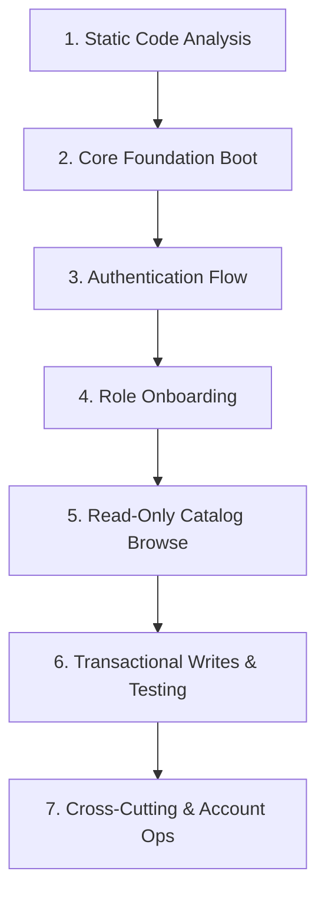

# Dependency-Ordered Verification & Debugging Sequence

> [!TIP]
> When testing or debugging the application, follow this **strict 7-step sequence**. 
> Because downstream features rely on upstream state (e.g. Test Taking requires an active Cart Purchase and Student Profile), testing in this exact order guarantees that any issue encountered is caused by the **current layer**, not a broken upstream dependency.

---

## Verification Sequence Overview

---

## Detailed Step-by-Step Checklist

### Step 1: Static Code Analysis & Build Verification
*Goal*: Ensure zero syntax errors, missing dependencies, or contract mismatches.
- **Command**: `flutter analyze`
- **Expected Result**: "No issues found!"
- **Troubleshooting**: Fix any missing imports, mismatched types, or invalid method parameters before launching the application.

---

### Step 2: Core Foundation & DI Initialization
*Goal*: Verify application bootstrap, service locator binding, and splash screen routing.
- **Entry Point**: `lib/main.dart` -> `SplashView`
- **Actions**: Launch app on target device/emulator.
- **Expected Result**: `configureDependencies()` completes with no `GetIt` registration exception; app smoothly navigates from `SplashView` to Auth or Home based on session state.

---

### Step 3: Authentication Flow
*Goal*: Establish user identity and role assignment.
- **Views**: `PhoneEntryView` -> `OtpEntryView` -> `RoleSelectionView`
- **Actions**:
  1. Input 10-digit phone number (e.g. `3001234567`).
  2. Enter OTP digits (`1234`).
  3. Select role: **Student** or **Teacher**.
- **Expected Result**: User session created in `authViewModelProvider`; redirected to onboarding.

---

### Step 4: Role-Based Onboarding
*Goal*: Complete user profile initialization required by downstream views.
- **Student Path**: `CampusSelectView` -> `BoardClassSelectView` -> `SubjectTeacherSelectView`
- **Teacher Path**: `TeacherSignupView` -> `TeacherPendingApprovalView`
- **Expected Result**: `Student` or `Teacher` profile saved; navigation unlocked to main shell with bottom navigation.

---

### Step 5: Read-Only Browse Flows
*Goal*: Test data fetching and rendering without mutating database state.
- **Student**: `StudentHomeView` -> Browse Enrolled Subjects -> View Test Catalog -> View Test Details.
- **Teacher**: `TeacherOverviewView` -> View Dashboard Summary Cards -> `TeacherStudentsView`.
- **Expected Result**: All summary cards, list rows, and empty state views render data cleanly with zero null errors or visual clipping.

---

### Step 6: Transactional Writes & Interactive Flow
*Goal*: Test end-to-end purchasing, test execution, auto-grading, and earnings update.
- **Order of Execution**:
  1. **Cart & Checkout**: Add paid test to cart -> `CartView` -> `CheckoutView` -> Complete purchase.
  2. **Test Taking**: Open purchased test -> `TestTakingView` -> Select answers -> Submit test.
  3. **Results & Grading**: View `TestResultsView` -> Check score breakdown.
  4. **Progress Update**: Check `StudentProgressView` (verify pie chart & attempt history update).
  5. **Teacher Dashboard**: Check `TeacherEarningsView` (verify commission updated).

---

### Step 7: Cross-Cutting Utilities & Account Management
*Goal*: Verify language switching, notification center, and session termination.
- **Actions**:
  1. Open `NotificationsView` -> Mark notifications as read.
  2. Open Profile -> Switch language between **English** and **Urdu** -> Confirm UI text updates instantly.
  3. Tap **Log Out** or **Delete Account** -> Confirm redirection back to `PhoneEntryView`.
